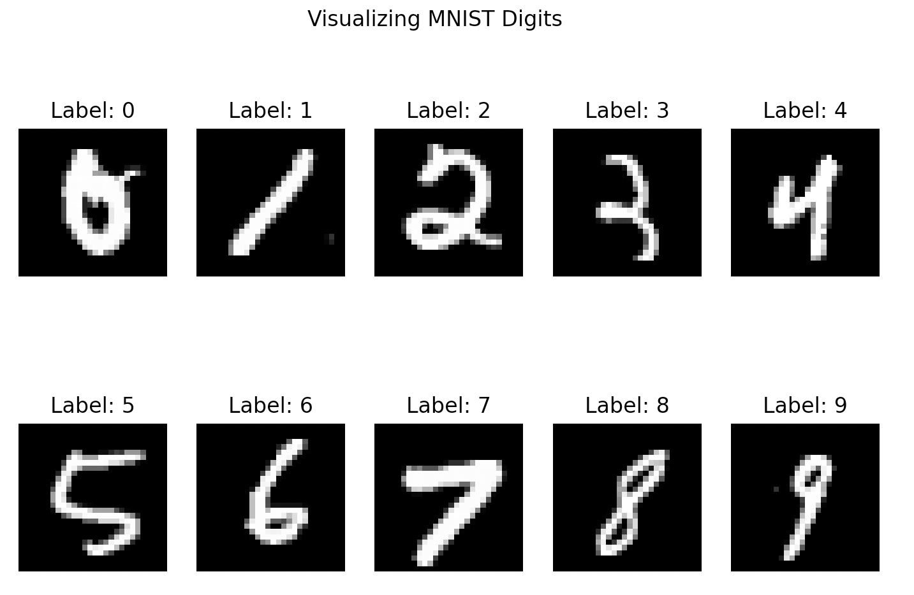
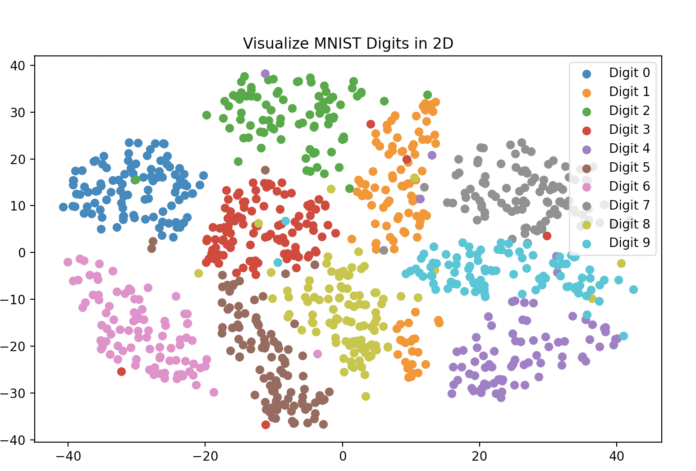
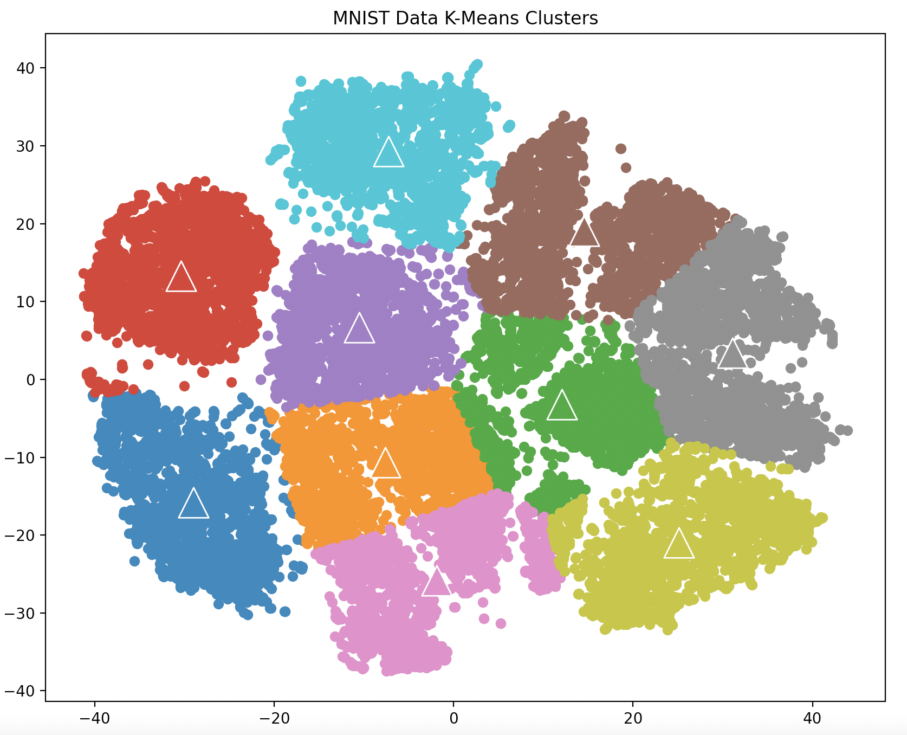

# clustering-alogrithms-from-scratch
K-Means and Hierarchical Clustering Algorithms from scratch in Python. Analysis and Results on MNIST data included.

Dataset: MNIST Digit Dataset
The MNIST data consists of 20,000 examples of 28 × 28 images of digits (i.e., numbers from 0-9).
`digits-raw.csv` contains the pixel information for each image (first column: image id, second column: class label, remaining 784 columns: pixel features).

`digits-embedding.csv` contains a precomputed 2-dimensional embedding of each image using t-Distributed Stochastic Neighbor Embedding (tSNE) (first column: image id, second column: class
label, third and fourth columns: image embedding features).

**28*28 pixel MNIST-Digits**:

**Visualizing MNIST Digits in 2D using t-SNE embedding:**

Algorithms Implemented:
1. K-Means Clustering
2. Hierarchical Clustering

Analysis of both the algorithms is done using (1) within-cluster sum of squared
distances, (2) silhouette coefficient, and (3) normalized mutual information gain (based on
image labels).

K-Means Clusters after 50 iterations with K=10:

